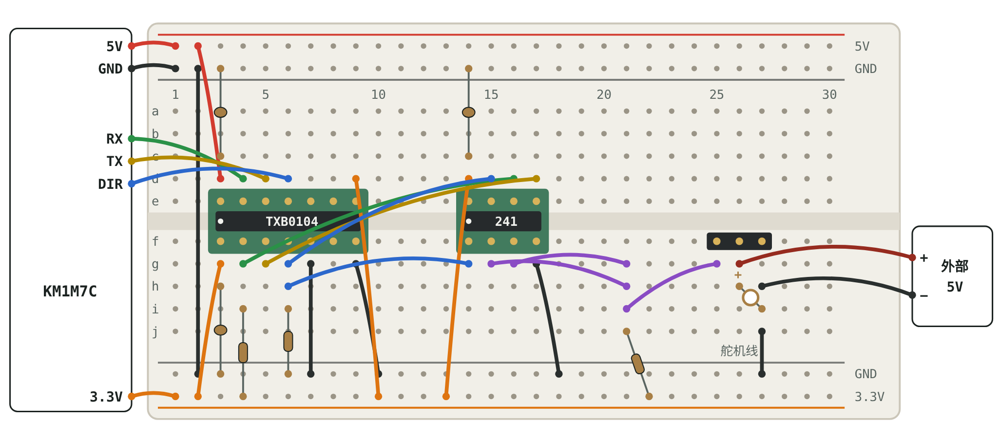
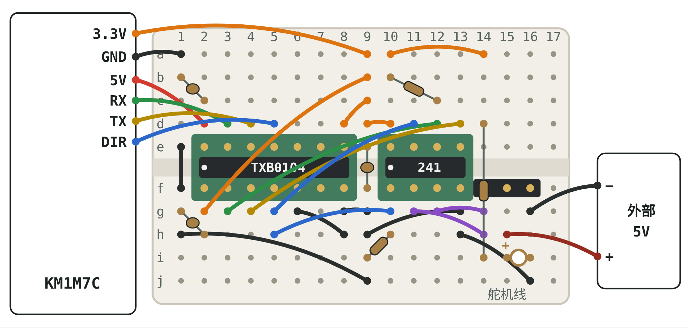
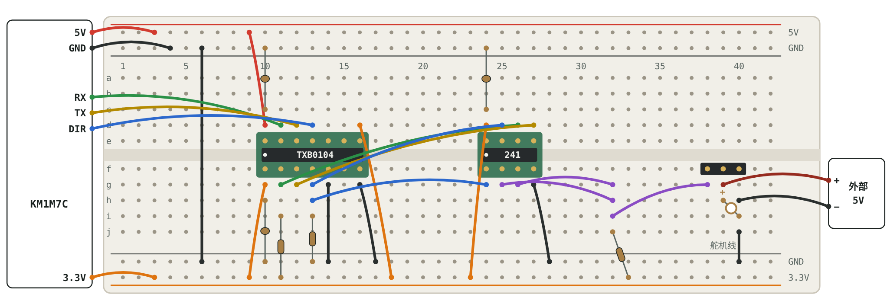

# XL330 面包板接线

信号链：**PC —USB— KM1M7C（5V IO）↔ TXB0104 ↔ 74LVC2G241（3.3V）↔ XL330**

- TXB0104 把 MCU 的 5V 信号转成 3.3V（B 侧 5V 接 MCU，A 侧 3.3V 接 241，必须 VCCA ≤ VCCB）。
- 74LVC2G241 把 TX、RX 合成一根 DATA 线。DIR = 1 发送（2Y 打开），DIR = 0 接收（1Y 打开）。
- 交互版（切换面包板尺寸、逐根打勾、点一行高亮对应的线）：下载 [`xl330_breadboard.html`](xl330_breadboard.html) 后用浏览器打开。

按面包板尺寸选一种布局：

| 尺寸 | 电源轨 | 跳转 |
|---|---|---|
| 30 列 · 400 孔（半尺寸） | 有 | [布局 A](#布局-a30-列--400-孔) |
| 17 列 · 170 孔（迷你） | 无 | [布局 B](#布局-b17-列--170-孔) |
| 63 列 · 830 孔（全尺寸） | 有 | [布局 C](#布局-c63-列--830-孔) |

不确定是哪种：数一下面包板边上印的最大列号。

## 动手前先看

1. 带电源轨的面包板：上面红轨 = **5V**，下面红轨 = **3.3V**，先贴胶带标注。迷你板没有电源轨，按清单用指定的列当电源。
2. 两路 5V 不能接在一起。外部 5V 只接舵机 VDD；MCU 板的 5V 只接 TXB0104 的 5V 侧。
3. 所有 GND 连在一起：MCU、外部电源、两颗芯片、舵机。
4. 转接板 1 脚在左下（芯片圆点一侧）。TXB0104 若是成品模块（丝印 VA、VB、A1…），按丝印名字接，列号只作参考。

## 电路图

三种布局的电路完全相同，只是列号不同。

## 布局 A：30 列 · 400 孔

400 孔半尺寸面包板（30 列，上下带电源轨）。上面红轨当 5V，下面红轨当 3.3V。有些半尺寸板的电源轨在中间断开，用万用表量一下第 1 列和第 27 列是否相通，不通就加一根跳线。

### 列号对照

| 列 | 上半 a–e | 下半 f–j |
|---|---|---|
| 3 | TXB 14 VCCB · 5V | TXB 1 VCCA · 3.3V |
| 4 | TXB 13 B1 · RX（MCU） | TXB 2 A1 · RX（241） |
| 5 | TXB 12 B2 · TX（MCU） | TXB 3 A2 · TX（241） |
| 6 | TXB 11 B3 · DIR（MCU） | TXB 4 A3 · DIR（241） |
| 7 | TXB 10 B4 · 不接 | TXB 5 A4 · 接 GND |
| 8 | TXB 9 NC | TXB 6 NC |
| 9 | TXB 8 OE · 接 3.3V | TXB 7 GND |
| 14 | 241 8 VCC · 3.3V | 241 1 1OE · DIR |
| 15 | 241 7 2OE · DIR | 241 2 1A · DATA |
| 16 | 241 6 1Y · RX | 241 3 2Y · DATA |
| 17 | 241 5 2A · TX | 241 4 GND |
| 21 | — | DATA 汇合点（2Y、1A、R1、舵机） |
| 25 | — | 舵机 3 号线 DATA |
| 26 | — | 舵机 2 号线 VDD（外部 5V） |
| 27 | — | 舵机 1 号线 GND |

### 接线清单

| # | 连接 | 线色 | 说明 |
|---|---|---|---|
| **1** | **电源轨（先不插芯片）** | | 这一组接完先做“上电前检查”的第 1、2 步。 |
| P1 | MCU 5V → 上红轨 1 | 红 | 上红轨从此是 5V |
| P2 | MCU GND → 上蓝轨 1 | 黑 |  |
| P3 | MCU 3.3V → 下红轨 1 | 橙 | 下红轨从此是 3.3V。板上没有 3.3V 输出时，用 AMS1117-3.3 模块从 5V 降压 |
| P4 | 上蓝轨 2 → 下蓝轨 2 | 黑 | 把两条 GND 轨连通 |
| **2** | **TXB0104 供电** | |  |
| K1 | 插入 TXB0104 转接板 |  | 第 3–9 列，跨在凹槽上，1 脚在第 3 列下侧 |
| P5 | 上红轨 2 → 3d | 红 | 14 脚 VCCB = 5V（MCU 一侧） |
| P6 | 下红轨 2 → 3g | 橙 | 1 脚 VCCA = 3.3V（241 一侧） |
| P7 | 9g → 下蓝轨 10 | 黑 | 7 脚 GND |
| P8 | 9d → 下红轨 10 | 橙 | 8 脚 OE 接 3.3V，芯片一直工作 |
| P9 | 7g → 下蓝轨 7 | 黑 | 5 脚 A4 不用，接地，不要悬空 |
| C1 | 0.1µF：3h ↔ 下蓝轨 3 | 元件 | VCCA 去耦电容 |
| C2 | 0.1µF：3c ↔ 上蓝轨 3 | 元件 | VCCB 去耦电容 |
| **3** | **74LVC2G241 供电** | |  |
| K2 | 插入 74LVC2G241 转接板 |  | 第 14–17 列，跨在凹槽上，1 脚在第 14 列下侧 |
| P10 | 下红轨 13 → 14d | 橙 | 8 脚 VCC = 3.3V |
| P11 | 17g → 下蓝轨 18 | 黑 | 4 脚 GND |
| C3 | 0.1µF：14c ↔ 上蓝轨 14 | 元件 | VCC 去耦电容 |
| **4** | **MCU ↔ TXB0104（5V 一侧）** | |  |
| S1 | 4d → MCU RX | 绿 | 13 脚 B1 |
| S2 | MCU TX → 5d | 黄 | 12 脚 B2 |
| S3 | MCU GPIO → 6d | 蓝 | 11 脚 B3，方向控制 DIR |
| **5** | **TXB0104 ↔ 74LVC2G241（3.3V 一侧）** | |  |
| S4 | 16d → 4g | 绿 | 241 的 1Y（6 脚）→ A1（2 脚），接收 |
| S5 | 5g → 17d | 黄 | A2（3 脚）→ 241 的 2A（5 脚），发送 |
| S6 | 6g → 15d | 蓝 | A3（4 脚）→ 2OE（7 脚） |
| S7 | 6h → 14g | 蓝 | A3（4 脚）→ 1OE（1 脚）。2OE 高电平有效、1OE 低电平有效，所以 DIR=1 发送，DIR=0 接收 |
| R2 | 100kΩ：4i ↔ 下红轨 4 | 元件 | RX 上拉 |
| R3 | 100kΩ：6i ↔ 下蓝轨 6 | 元件 | DIR 下拉 |
| **6** | **DATA 线** | |  |
| K3 | 插入 3 针排针：25f、26f、27f |  | 舵机线按 25 = DATA（3 号）、26 = VDD（2 号）、27 = GND（1 号）接上 |
| S8 | 16g → 21g | 紫 | 2Y（3 脚）→ DATA |
| S9 | 15g → 21h | 紫 | 1A（2 脚）← DATA |
| R1 | 10kΩ：21j ↔ 下红轨 22 | 元件 | DATA 上拉到 3.3V |
| S10 | 21i → 25g | 紫 | DATA → 舵机 3 号线 |
| **7** | **舵机电源** | | 外部 5V 电源先不要通电。 |
| X1 | 外部 5V + → 26g | 红（外部） | 只接这里，不要接到上红轨 |
| X2 | 外部电源 − → 27h | 黑 | 舵机 GND |
| X3 | 27j → 下蓝轨 27 | 黑 | 舵机地和逻辑地连通 |
| C4 | 100µF：+ 脚 26h，− 脚 27i | 元件 | 电解电容有极性，长脚是 +，接反会损坏 |

## 布局 B：17 列 · 170 孔

170 孔迷你面包板（17 列，没有电源轨）。用列代替电源轨：第 1 列上下两半都当 GND；第 9 列上半当 3.3V、下半当 GND；第 10 列上半是 241 的 VCC，也是 3.3V。几乎每个孔都用上了，插之前对照清单。

### 列号对照

| 列 | 上半 a–e | 下半 f–j |
|---|---|---|
| 2 | TXB 14 VCCB · 5V | TXB 1 VCCA · 3.3V |
| 3 | TXB 13 B1 · RX（MCU） | TXB 2 A1 · RX（241） |
| 4 | TXB 12 B2 · TX（MCU） | TXB 3 A2 · TX（241） |
| 5 | TXB 11 B3 · DIR（MCU） | TXB 4 A3 · DIR（241） |
| 6 | TXB 10 B4 · 不接 | TXB 5 A4 · 接 GND |
| 7 | TXB 9 NC | TXB 6 NC |
| 8 | TXB 8 OE · 接 3.3V | TXB 7 GND |
| 10 | 241 8 VCC · 3.3V | 241 1 1OE · DIR |
| 11 | 241 7 2OE · DIR | 241 2 1A · DATA |
| 12 | 241 6 1Y · RX | 241 3 2Y · DATA |
| 13 | 241 5 2A · TX | 241 4 GND |
| 1 | GND | GND（和上半连通） |
| 9 | 3.3V | GND |
| 14 | 3.3V（给 R1） | DATA 汇合点，也是舵机 3 号线 DATA |
| 15 | — | 舵机 2 号线 VDD（外部 5V） |
| 16 | — | 舵机 1 号线 GND |

### 接线清单

| # | 连接 | 线色 | 说明 |
|---|---|---|---|
| **1** | **电源列（先不插芯片）** | | 这一组接完先做“上电前检查”的第 1、2 步。 |
| M1 | MCU GND → 1a | 黑 | 第 1 列上半从此是 GND |
| L1 | 1e → 1f | 黑 | 跨过凹槽，第 1 列下半也是 GND |
| M2 | MCU 3.3V → 9a | 橙 | 第 9 列上半从此是 3.3V。板上没有 3.3V 输出时，用 AMS1117-3.3 模块从 5V 降压 |
| L2 | 9j → 1h | 黑 | 第 9 列下半当 GND，和第 1 列连通 |
| C3 | 0.1µF：9e ↔ 9f | 元件 | 跨过凹槽，接在 3.3V 和 GND 之间的去耦电容 |
| **2** | **TXB0104 供电** | |  |
| K1 | 插入 TXB0104 转接板 |  | 第 2–8 列，跨在凹槽上，1 脚在第 2 列下侧 |
| M3 | MCU 5V → 2d | 红 | 14 脚 VCCB = 5V，直接从 MCU 接过来 |
| P6 | 9b → 2g | 橙 | 1 脚 VCCA = 3.3V |
| P8 | 8d → 9c | 橙 | 8 脚 OE 接 3.3V，芯片一直工作 |
| P7 | 8g → 9g | 黑 | 7 脚 GND |
| P9 | 6g → 8h | 黑 | 5 脚 A4 不用，接到旁边的 GND 列 |
| C1 | 0.1µF：2h ↔ 1g | 元件 | VCCA 去耦电容 |
| C2 | 0.1µF：2c ↔ 1b | 元件 | VCCB 去耦电容 |
| **3** | **74LVC2G241 供电** | |  |
| K2 | 插入 74LVC2G241 转接板 |  | 第 10–13 列，跨在凹槽上，1 脚在第 10 列下侧 |
| P10 | 9d → 10d | 橙 | 8 脚 VCC = 3.3V |
| P11 | 13g → 9h | 黑 | 4 脚 GND |
| **4** | **MCU ↔ TXB0104（5V 一侧）** | |  |
| S1 | 3d → MCU RX | 绿 | 13 脚 B1 |
| S2 | MCU TX → 4d | 黄 | 12 脚 B2 |
| S3 | MCU GPIO → 5d | 蓝 | 11 脚 B3，方向控制 DIR |
| **5** | **TXB0104 ↔ 74LVC2G241（3.3V 一侧）** | |  |
| S4 | 12d → 3g | 绿 | 241 的 1Y（6 脚）→ A1（2 脚），接收 |
| S5 | 4g → 13d | 黄 | A2（3 脚）→ 241 的 2A（5 脚），发送 |
| S6 | 5g → 11d | 蓝 | A3（4 脚）→ 2OE（7 脚） |
| S7 | 5h → 10g | 蓝 | A3（4 脚）→ 1OE（1 脚）。2OE 高电平有效、1OE 低电平有效，所以 DIR=1 发送，DIR=0 接收 |
| R2 | 100kΩ：10b ↔ 12c | 元件 | RX 上拉。第 10 列上半是 3.3V，第 12 列上半是 RX |
| R3 | 100kΩ：10h ↔ 9i | 元件 | DIR 下拉到第 9 列下半的 GND |
| **6** | **DATA 线** | |  |
| K3 | 插入 3 针排针：14f、15f、16f |  | 舵机线按 14 = DATA（3 号）、15 = VDD（2 号）、16 = GND（1 号）接上 |
| L3 | 10a → 14a | 橙 | 把 3.3V 引到第 14 列上半，给 R1 用 |
| S8 | 12g → 14g | 紫 | 2Y（3 脚）→ DATA |
| S9 | 11g → 14h | 紫 | 1A（2 脚）← DATA |
| R1 | 10kΩ：14d ↔ 14i | 元件 | 跨过凹槽，DATA 上拉到 3.3V |
| **7** | **舵机电源** | | 外部 5V 电源先不要通电。 |
| X1 | 外部 5V + → 15h | 红（外部） | 只接这里，不要接到 MCU 的 5V |
| X2 | 外部电源 − → 16g | 黑 | 舵机 GND |
| X3 | 16j → 13h | 黑 | 舵机地和逻辑地连通（第 13 列下半是 241 的 GND） |
| C4 | 100µF：+ 脚 15i，− 脚 16i | 元件 | 电解电容有极性，长脚是 +，接反会损坏 |

## 布局 C：63 列 · 830 孔

830 孔全尺寸面包板（63 列，上下带电源轨）。布局只用到第 40 列。上面红轨当 5V，下面红轨当 3.3V。

### 列号对照

| 列 | 上半 a–e | 下半 f–j |
|---|---|---|
| 10 | TXB 14 VCCB · 5V | TXB 1 VCCA · 3.3V |
| 11 | TXB 13 B1 · RX（MCU） | TXB 2 A1 · RX（241） |
| 12 | TXB 12 B2 · TX（MCU） | TXB 3 A2 · TX（241） |
| 13 | TXB 11 B3 · DIR（MCU） | TXB 4 A3 · DIR（241） |
| 14 | TXB 10 B4 · 不接 | TXB 5 A4 · 接 GND |
| 15 | TXB 9 NC | TXB 6 NC |
| 16 | TXB 8 OE · 接 3.3V | TXB 7 GND |
| 24 | 241 8 VCC · 3.3V | 241 1 1OE · DIR |
| 25 | 241 7 2OE · DIR | 241 2 1A · DATA |
| 26 | 241 6 1Y · RX | 241 3 2Y · DATA |
| 27 | 241 5 2A · TX | 241 4 GND |
| 32 | — | DATA 汇合点（2Y、1A、R1、舵机） |
| 38 | — | 舵机 3 号线 DATA |
| 39 | — | 舵机 2 号线 VDD（外部 5V） |
| 40 | — | 舵机 1 号线 GND |

### 接线清单

| # | 连接 | 线色 | 说明 |
|---|---|---|---|
| **1** | **电源轨（先不插芯片）** | | 这一组接完先做“上电前检查”的第 1、2 步。 |
| P1 | MCU 5V → 上红轨 3 | 红 | 上红轨从此是 5V |
| P2 | MCU GND → 上蓝轨 4 | 黑 |  |
| P3 | MCU 3.3V → 下红轨 3 | 橙 | 下红轨从此是 3.3V。板上没有 3.3V 输出时，用 AMS1117-3.3 模块从 5V 降压 |
| P4 | 上蓝轨 6 → 下蓝轨 6 | 黑 | 把两条 GND 轨连通 |
| **2** | **TXB0104 供电** | |  |
| K1 | 插入 TXB0104 转接板 |  | 第 10–16 列，跨在凹槽上，1 脚在第 10 列下侧 |
| P5 | 上红轨 9 → 10d | 红 | 14 脚 VCCB = 5V（MCU 一侧） |
| P6 | 下红轨 9 → 10g | 橙 | 1 脚 VCCA = 3.3V（241 一侧） |
| P7 | 16g → 下蓝轨 17 | 黑 | 7 脚 GND |
| P8 | 16d → 下红轨 18 | 橙 | 8 脚 OE 接 3.3V，芯片一直工作 |
| P9 | 14g → 下蓝轨 14 | 黑 | 5 脚 A4 不用，接地，不要悬空 |
| C1 | 0.1µF：10h ↔ 下蓝轨 10 | 元件 | VCCA 去耦电容 |
| C2 | 0.1µF：10c ↔ 上蓝轨 10 | 元件 | VCCB 去耦电容 |
| **3** | **74LVC2G241 供电** | |  |
| K2 | 插入 74LVC2G241 转接板 |  | 第 24–27 列，跨在凹槽上，1 脚在第 24 列下侧 |
| P10 | 下红轨 23 → 24d | 橙 | 8 脚 VCC = 3.3V |
| P11 | 27g → 下蓝轨 28 | 黑 | 4 脚 GND |
| C3 | 0.1µF：24c ↔ 上蓝轨 24 | 元件 | VCC 去耦电容 |
| **4** | **MCU ↔ TXB0104（5V 一侧）** | |  |
| S1 | 11d → MCU RX | 绿 | 13 脚 B1 |
| S2 | MCU TX → 12d | 黄 | 12 脚 B2 |
| S3 | MCU GPIO → 13d | 蓝 | 11 脚 B3，方向控制 DIR |
| **5** | **TXB0104 ↔ 74LVC2G241（3.3V 一侧）** | |  |
| S4 | 26d → 11g | 绿 | 241 的 1Y（6 脚）→ A1（2 脚），接收 |
| S5 | 12g → 27d | 黄 | A2（3 脚）→ 241 的 2A（5 脚），发送 |
| S6 | 13g → 25d | 蓝 | A3（4 脚）→ 2OE（7 脚） |
| S7 | 13h → 24g | 蓝 | A3（4 脚）→ 1OE（1 脚）。2OE 高电平有效、1OE 低电平有效，所以 DIR=1 发送，DIR=0 接收 |
| R2 | 100kΩ：11i ↔ 下红轨 11 | 元件 | RX 上拉 |
| R3 | 100kΩ：13i ↔ 下蓝轨 13 | 元件 | DIR 下拉 |
| **6** | **DATA 线** | |  |
| K3 | 插入 3 针排针：38f、39f、40f |  | 舵机线按 38 = DATA（3 号）、39 = VDD（2 号）、40 = GND（1 号）接上 |
| S8 | 26g → 32g | 紫 | 2Y（3 脚）→ DATA |
| S9 | 25g → 32h | 紫 | 1A（2 脚）← DATA |
| R1 | 10kΩ：32j ↔ 下红轨 33 | 元件 | DATA 上拉到 3.3V |
| S10 | 32i → 38g | 紫 | DATA → 舵机 3 号线 |
| **7** | **舵机电源** | | 外部 5V 电源先不要通电。 |
| X1 | 外部 5V + → 39g | 红（外部） | 只接这里，不要接到上红轨 |
| X2 | 外部电源 − → 40h | 黑 | 舵机 GND |
| X3 | 40j → 下蓝轨 40 | 黑 | 舵机地和逻辑地连通 |
| C4 | 100µF：+ 脚 39h，− 脚 40i | 元件 | 电解电容有极性，长脚是 +，接反会损坏 |

## 上电前检查

1. 接完第 1 组、插芯片之前：万用表蜂鸣档测 5V 对 GND、3.3V 对 GND，都不能响。
2. 插 MCU 的 USB：5V 处约 5V，3.3V 处约 3.3V。确认后断电。
3. 接完芯片供电后上电：TXB0104 第 1 脚 3.3V、第 14 脚 5V；74LVC2G241 第 8 脚 3.3V。
4. 舵机先不插，接通外部电源：舵机 VDD 列对 GND 列约 5V（布局 A 第 26/27 列，B 第 15/16 列，C 第 39/40 列）。
5. 上电顺序：先 MCU 的 USB，再外部 5V。断电相反。

## 电源方案

- **当前方案**：MCU 板由 USB 供电，它的 5V、3.3V 引脚作为输出给面包板；外部 5V 只给舵机。
- **改用外部 5V 给逻辑也可以**：外部 5V 同时给舵机和 TXB0104 的 5V 侧，但 MCU 的 5V 脚就不能再接进来。两个 5V 电源并在一起会互相倒灌，可能损坏电脑 USB 口。
- **更简单的接法**：XL330 的 DATA 能耐受 5V TTL，74LVC2G241 也支持 5V 供电，所以可以去掉 TXB0104，把 241 和 R1 接 5V，MCU 直接连 241。保留 TXB0104 是为了演示电平转换。

## 软件要点

- XL330 出厂：ID 1，57600 bps，Protocol 2.0。
- 发送：DIR = 1 → 写完所有字节 → 等 UART“发送完成”标志（不是“发送缓冲空”）→ DIR = 0 → 接收应答。
- 发送期间 1Y 关闭，RX 收不到自己发出的数据，没有回显。

## 物料

| 物料 | 数量 |
|---|---|
| 面包板（以上三种尺寸任一） | 1 |
| TXB0104 + 14 脚转 DIP 转接板 | 1 |
| SN74LVC2G241 + 8 脚转接板（DCU = VSSOP 0.5mm，DCT = SM8 0.65mm，按后缀买） | 1 |
| 电阻 10kΩ / 100kΩ | 1 / 2 |
| 瓷片电容 0.1µF | 3 |
| 电解电容 100µF / 16V | 1 |
| 3 针排针 | 1 |
| XL330 转杜邦线（一端 JST EH 3P） | 1 |
| 外部 5V 电源（2A 以上）+ DC 转接线端子 | 1 |
| 杜邦线：红 橙 黑 黄 绿 蓝 紫 | 若干 |
