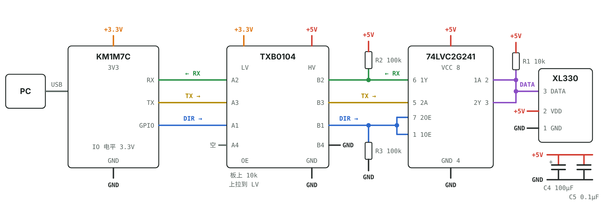
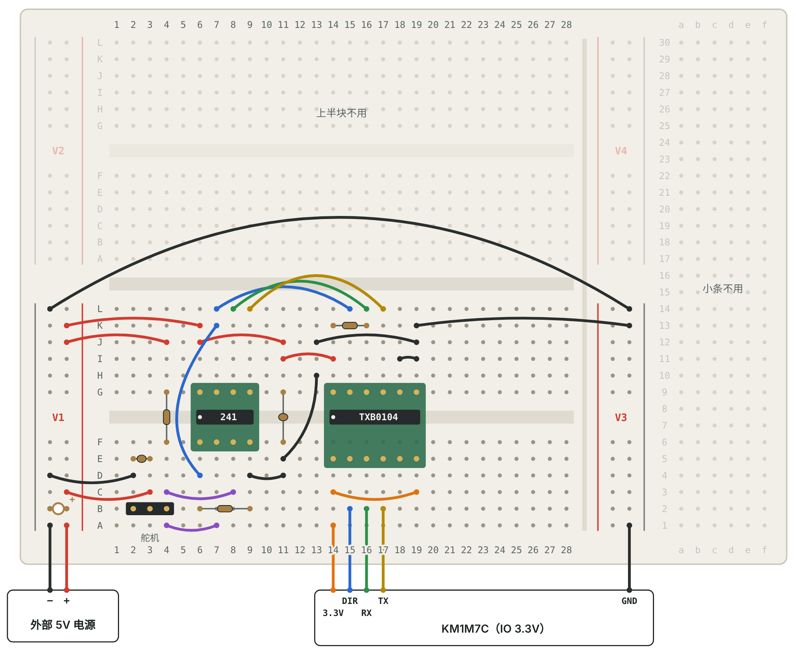

# XL330 面包板接线

信号链：**PC —USB— KM1M7C（3.3V IO）↔ TXB0104（3.3V ↔ 5V）↔ 74LVC2G241（5V）↔ XL330**

- TXB0104 把 MCU 的 3.3V 信号转成 5V：A 侧（VCCA = 3.3V）接 MCU，B 侧（VCCB = 5V）接 241。
- 74LVC2G241 把 TX、RX 合成一根 DATA 线。DIR = 1 发送（2Y 打开），DIR = 0 接收（1Y 打开）。
- 5V 一侧（241、TXB0104 的 B 侧、舵机）全部由外部 5V 电源供电；MCU 只提供 3.3V 和 GND，它的 5V 引脚不用。
- 交互版（逐根打勾、点一行高亮对应的线）：下载 [`xl330_breadboard.html`](xl330_breadboard.html) 后用浏览器打开。

## 完整流程

1. 对照“物料”备齐元件，确认两块转接板和芯片封装匹配。
2. 按“接线清单”逐组接线，每组接完做对应的“上电前检查”。
3. 用 [`firmware/`](../../firmware/README.md) 里的驱动做“第一次通信测试”：ping → LED 闪 → 舵机转。
4. 不通时看“排查”表。

## 动手前先看

1. 面包板按照片的方向放：V1、V2 电源轨在左边，最右边是 1–30 的小条。只用下半块，也就是 V1 和 V3 中间那一块（28 列，槽两边各 6 个孔）。上半块、V2、V4 和小条都不用。
2. **V1 = 外部 5V 和 GND，V3 − = MCU 的 GND（V3 + 不用）。** 每条电源轨里，靠里（红线）那列是 +，靠外（黑线）那列是 −。先贴胶带标注。MCU 的 3.3V 直接插到第 14 列。
3. MCU 板的 5V 引脚空着不接。同一条电源线上只能有一个电源。
4. 所有 GND 都要连在一起：外部电源的地和 MCU 的地靠 P1 那根长线接通。
5. 两块转接板的 1 脚（圆点）都朝左下：在槽下方（A–F 一侧）、靠 V1 那头。241 的两排针插 G 行和 F 行；TXB0104 的转接板宽一些，两排针插 G 行和 E 行。E 和 F 同属槽下方那一组，电气上一样。

## 电路图



同名的电源标签表示接在同一条电源线上：+5V 是外部 5V 电源（同时给舵机供电），+3.3V 来自 MCU 板。舵机的 VDD 和 GND 之间按 ROBOTIS 推荐电路并联 100µF 电解电容和 0.1µF 瓷片电容（见 [ROBOTIS e-Manual 的 Communication Circuit](https://emanual.robotis.com/docs/en/dxl/x/xl330-m288/#communication-circuit)）。TXB0104 的三个通道可以随意分配，这里按 A1 = DIR、A2 = RX、A3 = TX 接，是为了让面包板上的连线不交叉。

## 面包板布局

这块板的电源轨在列的两头（左边 V1/V2，右边 V3/V4），不是沿着列走，所以用第 11 列做了一个 5V 和 GND 的中转点，两颗芯片的电源从这里接，线更短。



## 列号对照

芯片跨在槽上，同一列槽上方（G–L）和槽下方（A–F）的孔互不相通。转接板的针插在哪一行都可以，列对就行。

| 列 | 槽上方 G–L（5V 一侧） | 槽下方 A–F |
|---|---|---|
| 2 | — | 舵机 1 号线 GND（排针插 B 行） |
| 3 | — | 舵机 2 号线 VDD（外部 5V） |
| 4 | 5V（给 R1） | 舵机 3 号线 DATA，DATA 汇合点 |
| 6 | 241 8 VCC · 5V（241 针插 G、F 行） | 241 1 1OE · DIR |
| 7 | 241 7 2OE · DIR | 241 2 1A · DATA |
| 8 | 241 6 1Y · RX | 241 3 2Y · DATA |
| 9 | 241 5 2A · TX | 241 4 GND |
| 11 | 5V 中转 | GND 中转 |
| 14 | TXB 14 VCCB · 5V（TXB 针插 G、E 行） | TXB 1 VCCA · 3.3V（MCU 直接接） |
| 15 | TXB 13 B1 · DIR（接 241） | TXB 2 A1 · DIR（接 MCU） |
| 16 | TXB 12 B2 · RX（接 241） | TXB 3 A2 · RX（接 MCU） |
| 17 | TXB 11 B3 · TX（接 241） | TXB 4 A3 · TX（接 MCU） |
| 18 | TXB 10 B4 · 不接 | TXB 5 A4 · 接 GND |
| 19 | TXB 9 NC | TXB 6 NC |
| 20 | TXB 8 OE · 接 5V | TXB 7 GND |

## 接线清单

编号只是方便对照：P 电源线，S 信号线，R 电阻，C 电容，K 插元件，E 外部电源，M 从 MCU 来的线。“10J”是第 10 列、J 行的孔；“V1 +”是 V1 电源轨的 + 那一列，插哪个孔都行。间距小的电阻可以竖着插。

| # | 连接 | 线色 | 说明 |
|---|---|---|---|
| **1** | **电源（先不插芯片）** | | 这一组接完先做“上电前检查”的第 1、2 步。外部电源和 MCU 先都不要通电。 |
| E1 | 外部 5V + → V1 + | 红 | V1 +（红线一侧，靠里那列）从此是外部 5V |
| E2 | 外部电源 − → V1 − | 黑 | V1 −（黑线一侧，靠外那列）是 GND |
| C4 | 100µF：+ 脚 V1 +，− 脚 V1 − | 元件 | 直接插在 V1 的 + 和 − 上。电解电容有极性，长脚是 +，接反会损坏 |
| M2 | MCU GND → V3 − | 黑 | V3 −（靠外那列）是 GND。V3 + 不用 |
| P1 | V1 − → V3 − | 黑 | 把两条 GND 连通。外部电源的地和 MCU 的地必须接在一起，这根线要长一点，从板子上方绕过去 |
| **2** | **舵机排针** | |  |
| K3 | 插入 3 针排针：2B、3B、4B |  | 舵机线按 2 = GND（1 号）、3 = VDD（2 号）、4 = DATA（3 号）接上 |
| P2 | V1 − → 2D | 黑 | 舵机 GND |
| P3 | V1 + → 3C | 红 | 舵机 VDD = 外部 5V |
| C5 | 0.1µF：2E ↔ 3E | 元件 | 舵机 VDD 和 GND 之间的瓷片电容。ROBOTIS 推荐电路在这里并联一个电解电容和一个 0.1µF，电解电容就是 V1 上的 C4 |
| **3** | **74LVC2G241 和中转列** | |  |
| K2 | 插入 74LVC2G241 转接板 |  | 第 6–9 列，一排针插 G 行、一排插 F 行，1 脚（圆点）在 6F |
| P4 | V1 + → 6K | 红 | 8 脚 VCC = 5V |
| P5 | 6J → 11J | 红 | 把 5V 引到第 11 列槽上方（中转） |
| P6 | 9D → 11D | 黑 | 把 241 的 GND（4 脚）引到第 11 列槽下方（中转） |
| C2 | 0.1µF：11G ↔ 11F | 元件 | 跨过槽，接在 5V 和 GND 中转之间的去耦电容 |
| R3 | 100kΩ：6B ↔ 9B | 元件 | DIR 下拉（1OE ↔ GND） |
| **4** | **TXB0104 供电** | |  |
| K1 | 插入 TXB0104 转接板 |  | 第 14–20 列，这块转接板宽一些：一排针插 G 行、一排插 E 行，1 脚（圆点）在 14E |
| P7 | 11I → 14I | 红 | 14 脚 VCCB = 5V |
| P8 | 14J → 20J | 红 | 8 脚 OE 接 5V，芯片一直工作 |
| M1 | MCU 3.3V → 14B | 橙 | 1 脚 VCCA = 3.3V，MCU 的 3.3V 直接插到这里 |
| C1 | 0.1µF：11C ↔ 14C | 元件 | VCCA 去耦电容（3.3V ↔ GND） |
| P10 | 20C → V3 − | 黑 | 7 脚 GND 接 V3 − |
| P11 | 9A → 20A | 黑 | 241 的 GND 和 TXB0104 的 GND 连通 |
| P12 | 18B → 20B | 黑 | 5 脚 A4 不用，接 GND，不要悬空 |
| **5** | **MCU ↔ TXB0104（3.3V 一侧，槽下方）** | |  |
| S1 | MCU GPIO → 15B | 蓝 | 2 脚 A1，方向控制 DIR |
| S2 | 16B → MCU RX | 绿 | 3 脚 A2，接收 |
| S3 | MCU TX → 17B | 黄 | 4 脚 A3，发送 |
| **6** | **TXB0104 ↔ 74LVC2G241（5V 一侧，槽上方）** | |  |
| S4 | 15L → 7L | 蓝 | B1（13 脚）→ 2OE（7 脚） |
| S5 | 8L → 16L | 绿 | 241 的 1Y（6 脚）→ B2（12 脚），接收 |
| S6 | 17L → 9L | 黄 | B3（11 脚）→ 241 的 2A（5 脚），发送 |
| S7 | 7K → 6D | 蓝 | 2OE（7 脚）→ 1OE（1 脚）。2OE 高电平有效、1OE 低电平有效，所以 DIR = 1 发送，DIR = 0 接收 |
| R2 | 100kΩ：14K ↔ 16K | 元件 | RX 上拉到 5V（VCCB ↔ B2） |
| **7** | **DATA 线** | |  |
| P13 | V1 + → 4J | 红 | 把 5V 引到第 4 列槽上方，给 R1 用 |
| R1 | 10kΩ：4G ↔ 4F | 元件 | 跨过槽，DATA 上拉到 5V |
| S8 | 8C → 4C | 紫 | 2Y（3 脚）→ DATA |
| S9 | 7A → 4A | 紫 | 1A（2 脚）← DATA |

## 自动核对

改过接线以后，运行一下：

```sh
python tools/check_wiring.py
```

脚本直接读取 `xl330_breadboard.html` 里的接线清单（和页面上是同一份），然后按这块面包板的连通规则把每个孔归到对应的网络：同一列槽下方 A–F 相通，槽上方 G–L 相通，每条电源轨整条相通。接着放上芯片、排针、导线和电阻电容，算出实际的网络，再和照电路图写的网络表逐个比对，检查这些项目：

- 每个网络的引脚都连在一起（没有漏接）。
- 不同网络之间没有连在一起（没有短路）。
- 电阻、电容两只脚跨在正确的两个网络上，电解电容的正负没有接反。
- NC、B4 这些不用的引脚什么都没接。
- 没有两样东西插进同一个孔，也没有导线一头悬空。
- 没有用到紧挨着转接板、可能被盖住的孔。

`python tools/check_wiring.py --selftest` 会故意改错几处（交叉接错、漏线、短路、正负接反、重复插孔等），确认每一种都能被发现。

脚本不能代替的有两件事：参考网络表是照电路图手工写的；电源轨整条相通是这块板的假设，要靠“上电前检查”第 1 步实测确认。脚本只核对“接线清单和电路图一致”，不做电压、电流这类电气仿真。

## 上电前检查

1. 接完第 1 组、插芯片之前：万用表打到蜂鸣档，测 V1 + 对 V1 −，不能响。再测 V1 + 最上面和最下面两个孔，应该响，说明整条是通的；V1 −、V3 − 也一样测。
2. 外部电源通电，测 V1 + 对 V1 − 约 5V；插上 MCU 的 USB，测第 14 列槽下方对 V3 − 约 3.3V。确认后都断电。
3. 接完芯片供电后再上电：TXB0104 第 1 脚约 3.3V、第 14 脚约 5V，74LVC2G241 第 8 脚约 5V。
4. 舵机线先别插，测第 3 列对第 2 列约 5V（舵机 VDD 对 GND）。
5. 上电顺序：先插 MCU 的 USB，再开外部 5V；断电顺序相反。顺序反了也不会损坏芯片，TXB0104 有一侧没电时输出会变成高阻。
6. 舵机上电时 LED 会闪一下，说明供电正常。

## 第一次通信测试

驱动代码在 [`firmware/`](../../firmware/README.md)，只需要用 KM1M7C 的 SDK 实现 5 个函数（DIR 引脚和 UART 收发）。`dxl_example_run()` 依次做三步，每步打印结果：

1. **Ping**：发 `FF FF FD 00 01 03 00 01 19 4E`，有应答就说明接线、DIR、波特率都对。XL330-M288 型号 1200，M077 为 1190。
2. **LED 闪 3 下**：往地址 65 写 1 再写 0。
3. **舵机来回转**：打开扭矩（地址 64），在 1024 和 3072 之间来回，并读回当前位置（地址 132）。

## 排查

| 现象 | 先查什么 |
|---|---|
| ping 一直没有应答 | 舵机上电时 LED 有没有闪；波特率是否 57600；MCU 的 DIR、RX、TX 是否分别接第 15、16、17 列（槽下方）；上电后（DIR = 0）第 4 列 DATA 对 GND 是否约 5V；DIR = 1 时 241 第 7 脚是否约 5V |
| 偶尔有应答，经常 CRC 错误 | DIR 切得太早，改为等“发送完成”标志；检查 GND 是否都连通，尤其是 P1 那根长线 |
| RX 收到自己刚发的字节 | 1OE 和 2OE 接反，两个缓冲器同时打开；核对 S4、S7 |
| 舵机一转通信就中断 | 外部电源电流不够，或 100µF 电容没接好；241 和舵机用的是同一路 5V |

## 三个电阻的作用

- **R1 10k**：收发切换的瞬间没人驱动 DATA，上拉到 5V 让它保持空闲的高电平。
- **R2 100k**：发送时 1Y 关闭，RX 这根线没人驱动，上拉让它停在空闲的高电平。
- **R3 100k**：MCU 没上电或复位时，TXB0104 的输出是高阻，DIR 被拉低，241 保持接收，不会去抢总线。

TXB0104 要求接在它引脚上的上下拉电阻不小于 50kΩ，所以 R2、R3 用 100k。R1 在 DATA 线上，不受这个限制。

## 电源方案

- MCU 板由 USB 供电，只用它的 3.3V（给 TXB0104 的 A 侧）和 GND。外部 5V 电源给舵机、74LVC2G241 和 TXB0104 的 B 侧供电，MCU 的 5V 引脚空着。这样 5V 只有一个来源，不会出现两个 5V 电源接在一起的问题。
- 更简单的接法：XL330 的 DATA 也接受 3.3V 电平，所以其实可以去掉 TXB0104，把 241 和 R1 接 3.3V，MCU 直接连 241。保留 TXB0104 是为了让总线一侧是 5V，演示电平转换。

## 软件要点

- XL330 出厂：ID 1，57600 bps，Protocol 2.0。
- 发送：DIR = 1 → 写完所有字节 → 等 UART“发送完成”标志（不是“发送缓冲空”）→ DIR = 0 → 接收应答。
- 发送期间 1Y 关闭，RX 收不到自己发出的数据，没有回显。

## 物料

| 物料 | 数量 |
|---|---|
| 面包板（照片这款） | 1 |
| TXB0104 + 14 脚转 DIP 转接板 | 1 |
| SN74LVC2G241 + 8 脚转接板（DCU = VSSOP 0.5mm，DCT = SM8 0.65mm，按后缀买） | 1 |
| 电阻 10kΩ / 100kΩ | 1 / 2 |
| 瓷片电容 0.1µF | 3 |
| 电解电容 100µF / 16V（脚距 2.5mm 以内） | 1 |
| 3 针排针 | 1 |
| XL330 转杜邦线（一端 JST EH 3P） | 1 |
| 外部 5V 电源（2A 以上）+ DC 转接线端子 | 1 |
| 杜邦线：红 橙 黑 黄 绿 蓝 紫 | 若干 |

转接板两排针的行距要是 0.3 英寸（7.62mm），才能跨在槽上。
